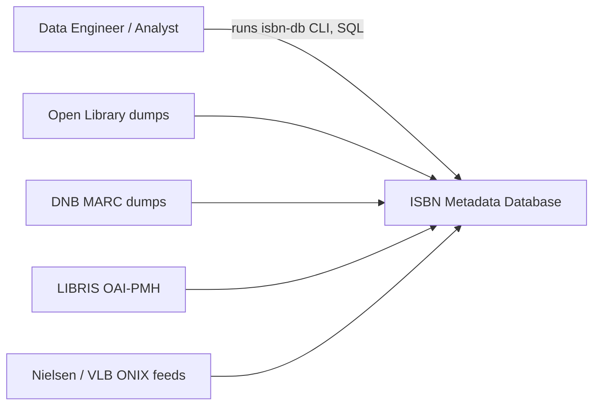
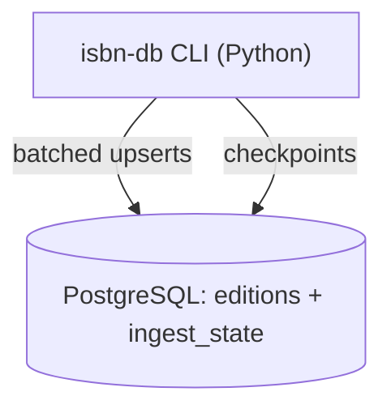
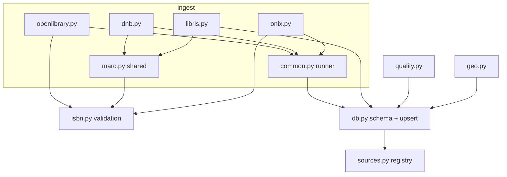
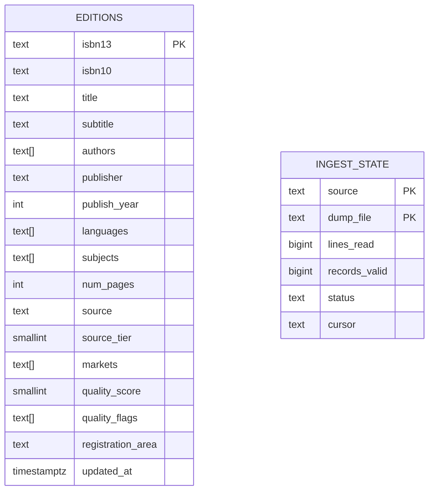
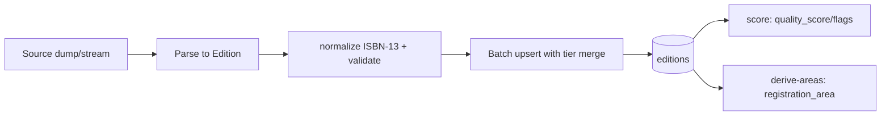
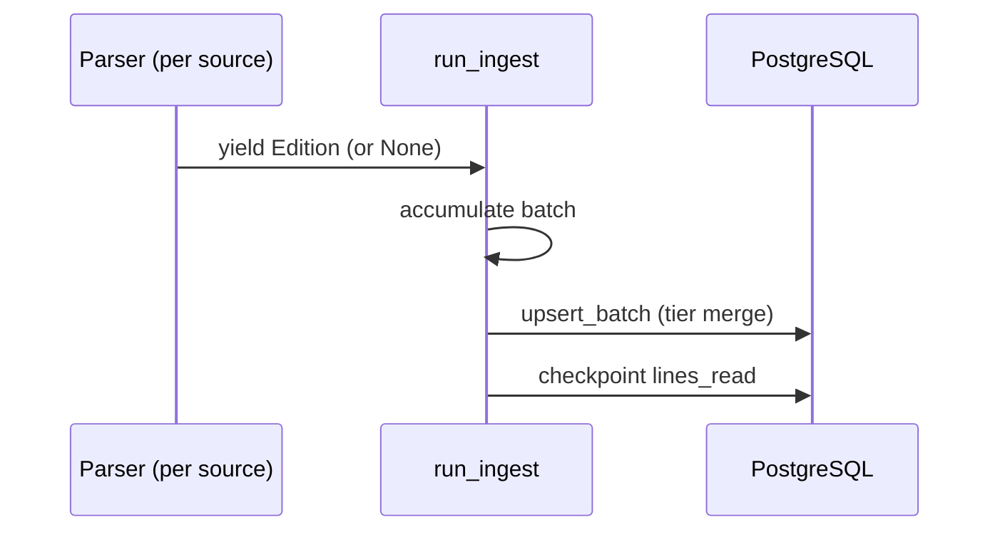

# ISBN Metadata Database -- Software Design Document

## Design Overview

### Purpose

This document describes the design of the ISBN metadata database: a system that ingests book
metadata from multiple bibliographic sources, normalizes it to a single canonical key, deduplicates
and merges records by source authority, scores each record's quality, and tags it with the issuing
country/language area. It exists to support **publisher and market analysis** over a broad, high-
quality corpus of book metadata.

### Scope

In scope: the ingest pipeline (Open Library, DNB, LIBRIS, ONIX), the PostgreSQL data model, the
cross-source merge, quality scoring, registration-area derivation, the `isbn-db` CLI, and a
read-only FastAPI **search API** (`src/isbn_db/api/`) that exposes the corpus to the Explorer UI and
the LLM-gateway MCP tools (see `docs/hosting-and-operations.md`). Out of scope: write/ingest APIs,
authentication beyond a bearer key, and real-time/streaming updates — ingestion remains a batch
pipeline, and the API serves the resulting analytical database.

### Design Goals

- Single canonical identity per book edition (ISBN-13), with strict validation on ingest.
- Pluggable, streaming, resumable ingest so multi-GB dumps and slow APIs can run unattended.
- Deterministic, explainable merge precedence across sources of differing authority.
- Source-independent country/language attribution to de-skew cross-market analysis.
- Minimal moving parts: Python + `uv` + a single PostgreSQL instance, no external services.

### References

| Document                  | Link / Reference                          |
|---------------------------|-------------------------------------------|
| Source research           | [docs/SOURCES.md](./SOURCES.md)           |
| Analysis examples         | [docs/ANALYSIS.md](./ANALYSIS.md)         |
| Paid-feed procurement     | [docs/PROCUREMENT.md](./PROCUREMENT.md)   |
| Operations guide          | [docs/operations-guide.md](./operations-guide.md) |
| Configuration reference   | [docs/configuration-reference.md](./configuration-reference.md) |

## Architectural Viewpoints

### Context View (C4 Level 1)

The system is operated by a data engineer/analyst. It pulls metadata from external bibliographic
sources and exposes a populated database for analytical SQL queries.

| External Entity        | Type   | Interaction                                             |
|------------------------|--------|---------------------------------------------------------|
| Data Engineer/Analyst  | User   | Runs `isbn-db` commands; queries `editions` via SQL     |
| Open Library           | System | Bulk `.txt.gz` editions dump (public domain)            |
| DNB                    | System | Bulk MARC21 `.mrc.gz` files (CC0)                       |
| LIBRIS                 | System | OAI-PMH MARCXML harvest (CC0)                           |
| Nielsen / VLB          | System | ONIX 3.0 file (paid, delivered out-of-band)             |

### Container View (C4 Level 2)

| Container      | Technology      | Responsibility                                        | Communication |
|----------------|-----------------|-------------------------------------------------------|---------------|
| `isbn-db` CLI  | Python 3.13, uv | Ingest, normalize, merge, score, derive areas         | psycopg / SQL |
| Database       | PostgreSQL 16   | Stores merged editions and per-file ingest checkpoints | TCP/SQL       |

### Component View (C4 Level 3)

| Component        | Responsibility                                              | Dependencies        |
|------------------|-------------------------------------------------------------|---------------------|
| `isbn.py`        | ISBN-10/13 validation, normalization, conversion            | —                   |
| `sources.py`     | Source registry (tier/cost/licensing) → merge precedence    | —                   |
| `ingest/*`       | Parse each source format into `Edition` records             | `isbn`, `marc`, `db` |
| `db.py`          | Schema, source-priority merge upsert, batch writes          | `psycopg`, `sources` |
| `quality.py`     | Per-record quality score and flags                          | `db`                |
| `geo.py`         | `registration_area` from ISBN prefix                        | `db`, range data    |

## Design Rationale

| Decision                                        | Rationale                                                                 | ADR Reference |
|-------------------------------------------------|---------------------------------------------------------------------------|---------------|
| Canonical key = ISBN-13                         | Single identity; ISBN-10 and ISBN-13 of the same edition collapse to one  | —             |
| PostgreSQL single table (`editions`)            | Analytical queries are simple aggregations; arrays cover multi-valued fields | —          |
| Source-tier whole-record merge                  | Deterministic, explainable precedence; cheap to apply in one upsert       | —             |
| Streaming + resumable ingest                    | Dumps are 10s of GB and the LIBRIS API is slow; runs must survive restarts | —            |
| Quality score in SQL, Python reference mirror   | Bulk scoring over tens of millions of rows must be set-based for speed      | —            |
| Registration area from ISBN prefix              | Country/language attribution independent of which source supplied the row  | —             |

## Data Design

### Data Storage

| Store       | Technology    | Purpose                                              | Retention Policy            |
|-------------|---------------|------------------------------------------------------|-----------------------------|
| `editions`  | PostgreSQL 16 | One merged row per canonical ISBN-13                 | Durable; rebuilt by re-ingest |
| `ingest_state` | PostgreSQL 16 | Per-source-file progress checkpoints (resume)     | Durable                     |

### Data Model

`editions` is keyed by `isbn13`. Multi-valued fields (`authors`, `languages`, `subjects`, `markets`,
`quality_flags`) are Postgres arrays. `ingest_state` tracks `(source, dump_file)` progress, including
an OAI-PMH resumption `cursor` for the LIBRIS harvest.

### Data Flow

Each source record is parsed into an `Edition`, its identifier normalized and check-digit validated
(invalid → dropped), then batch-upserted with the source-tier merge rule. Quality scoring and area
derivation are separate set-based passes run after ingest.

## Interface Design

### Internal Interfaces

| Interface         | From            | To           | Protocol | Description                          |
|-------------------|-----------------|--------------|----------|--------------------------------------|
| `Edition.as_row`  | ingest modules  | `db.upsert_batch` | in-process | Normalized, length-capped row tuple |
| `run_ingest`      | `common.py`     | PostgreSQL   | SQL      | Batched upserts + checkpoint writes  |
| merge upsert      | `db.py`         | `editions`   | SQL      | `ON CONFLICT` tier-gated replacement |

### External Interfaces

| Interface        | External System | Direction | Protocol     | Description                         |
|------------------|-----------------|-----------|--------------|-------------------------------------|
| Dump download    | Open Library / DNB | In     | HTTPS (gzip) | Bulk file fetch (resumable curl)    |
| OAI-PMH harvest  | LIBRIS          | In        | HTTPS/OAI-PMH | MARCXML `ListRecords`, resumptionToken |
| ONIX import      | Nielsen / VLB   | In        | File (XML)   | ONIX 3.0 product records            |

## Component Design

### Ingest runner (`ingest/common.py`)

**Responsibility:** Drive a source's record generator: batch-upsert valid editions, checkpoint
progress, and resume from the last checkpoint.

**Key Classes / Modules:**

| Class / Module     | Responsibility                                             |
|--------------------|------------------------------------------------------------|
| `run_ingest`       | Consume records, batch, upsert, checkpoint, resume         |
| `Edition`          | Parsed record; `as_row()` caps text lengths                |
| `upsert_batch`     | Single-round-trip multi-row `INSERT ... ON CONFLICT`       |

**Key Interactions:**

**Algorithms:**

The merge is an `INSERT ... ON CONFLICT (isbn13) DO UPDATE ... WHERE EXCLUDED.source_tier >=
editions.source_tier`. Each batch deduplicates ISBNs in-memory first (Postgres forbids touching the
same conflict key twice per statement). Quality scoring is a single set-based `UPDATE` using a CASE
expression mirrored from the Python reference scorer; `FOR UPDATE SKIP LOCKED` lets it run alongside
an active ingest without deadlocking.

## Error Handling

### Error Categories

| Category   | Description                                  | Handling Strategy                                   |
|------------|----------------------------------------------|-----------------------------------------------------|
| Transient  | Network drop mid-download; OAI request fails | Resume download via `curl -C -`; retry OAI requests |
| Permanent  | Invalid ISBN / malformed record              | Skip the record (never aborts the run)              |
| Critical   | Truncated/incomplete download                | Verified against `Content-Length`; abort before ingest |

### Error Codes

| Code | Description                          | HTTP Status | User Message                              |
|------|--------------------------------------|-------------|-------------------------------------------|
| N/A  | CLI tool; failures surface as non-zero exit + log line | N/A | Logged message (e.g. "DOWNLOAD FAILED ...") |

### Logging and Monitoring

The pipeline logs progress lines (records/sec, cumulative counts) to stdout and per-run log files
under `data/`. Long-running jobs (full OL ingest, LIBRIS harvest) are observed via `isbn-db stats`
and the `ingest_state` table rather than a metrics backend.

## Security Design

### Authentication

The database uses local username/password auth on an isolated container port (5433). No public
network exposure. The optional SonarQube scan uses a token from the developer's shell environment.

### Authorization

Single-tenant developer/analyst access. No application-level RBAC — access is controlled by Postgres
credentials and host access.

### Data Protection

| Data Category        | At Rest                        | In Transit            |
|----------------------|--------------------------------|-----------------------|
| Bibliographic metadata | Local Postgres volume        | HTTPS on source fetch |
| Credentials (DSN, tokens) | Environment variables only | N/A (local)           |

### Threat Model

| Threat                                   | Category (STRIDE) | Mitigation                                               |
|------------------------------------------|-------------------|---------------------------------------------------------|
| Committing large dumps or secrets        | Information disclosure | `data/`, `.env`, local settings git-ignored          |
| Ingesting a truncated/corrupt dump       | Tampering         | Download verified vs `Content-Length` before ingest     |
| Redistributing licence-restricted data   | Repudiation/legal | `sources.py` flags `redistributable`; enrichment-only sources are not stored in the shared product |

---

| Version | Date       | Author            | Changes        |
|---------|------------|-------------------|----------------|
| 0.1     | 2026-06-19 | Crius Technology  | Initial draft  |
